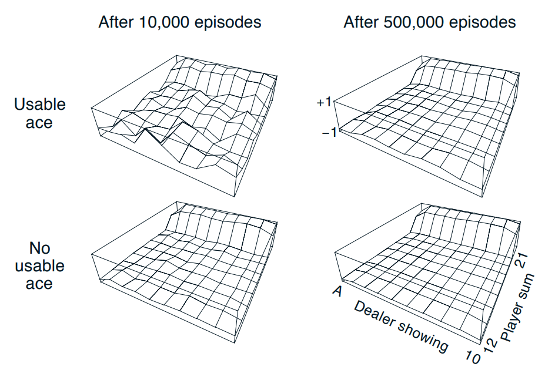

### Exercise 5.1

Consider the diagrams on the right in Figure 5.1. Why does the estimated value function jump up for the last two rows in the rear? Why does it drop off for the whole last row on the left? Why are the frontmost values higher in the upper diagrams than in the lower?

В конце графиков у игрока на руке 20 и 21 и он перестаёт брать карты. С такой суммой шанс выигрыша будет выше, чем с 19 и меньше.

В левой части график спадает, так как у дилера есть туз, который может использоваться как 1, что даёт шансы дилеру на победу.

С используемым тузом у игрока снижаются шансы на проигрыш из-за перебора.

### Exercise 5.2

Suppose every-visit MC was used instead of first-visit MC on the blackjack task. Would you expect the results to be very different? Why or why not?

Использование Every-visit означает, что значение туза сменяется с 11 до 1. Такие случаи не должны происходить часто, так что результаты не должы сильно отличаться.

### Exercise 5.3

What is the backup diagram for Monte Carlo estimation of $q_\pi$?

Диаграммы по структуре аналогичный диаграмме для функции $V_{\pi}(s)$, которая строится по Монте Карло. Только здесь также появляются вершины, обозначающие выбранное действие.

### Exercise 5.4

The pseudocode for Monte Carlo ES is ineffcient because, for each state–action pair, it maintains a list of all returns and repeatedly calculates their mean. It would be more effcient to use techniques similar to those explained in Section 2.4 to maintain just the mean and a count (for each state–action pair) and update them incrementally. Describe how the pseudocode would be altered to achieve this.

Для решения этой проблемы будем подсчитывать количество элементов, взятых в усреднении и делать соответствующее инкрементирование:

Сперва увеличиваем счётчик $N$, потом:

$$
    Q(S_t,A_t) = Q(S_t,A_t) + \dfrac{1}{N}(G - Q(S_t,A_t))
$$
