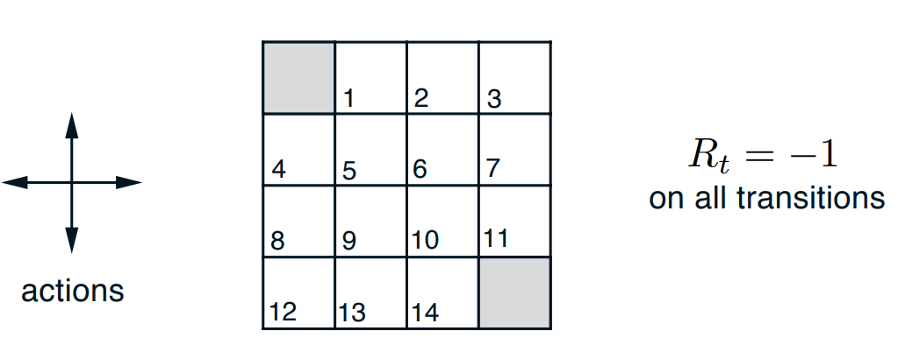
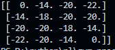
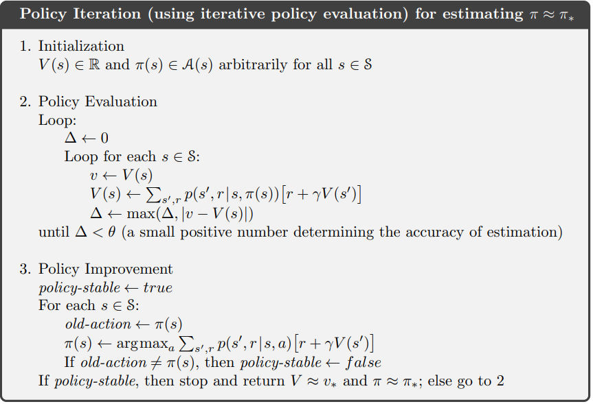

### Exercise 4.1. 
In Example 4.1, if $\pi$ is the equiprobable random policy, what is $q_{\pi}(11, \text{down})$?
What is $q_{\pi}(7,\text{down})$?

Смещение вниз из положения 11 приводит нас в терминальное состояние и эпизод заканчивается, награда каждого перехода равна -1. Тогда награда за такое действие будет -1

Для нахождения $q_{\pi}(7,\text{down})$ посчитаем итеративным способом таблицу функции наград $v_{\pi}(s)$. В такой реализации функция наград выглядит следующим образом:

Теперь можем подсчитать $q_{\pi}(7,\text{down}) = \mathbb{E}_{\pi}[G_t | S_t = s, A_t = a] = \underbrace{R_t}_{-1} + \underbrace{\gamma}_{1} \underbrace{\mathbb{E}_{\pi}[G_{t+1} | S_{t+1} = s']}_{v_\pi(11)} = -1 - 14 = -15 $

### Exercise 4.2

In Example 4.1, suppose a new state 15 is added to the gridworld just below
state 13, and its actions, left, up, right, and down, take the agent to states 12, 13, 14, and 15, respectively. Assume that the transitions from the original states are unchanged. What, then, is $v_π(15)$ for the equiprobable random policy? Now suppose the dynamics of state 13 are also changed, such that action down from state 13 takes the agent to the new state 15. What is $v_π(15)$ for the equiprobable random policy in this case?

Теперь у нас появилось новое состояние 15, из  которого можно попасть в 12, 13, 14 и в само себя, по формуле для функции наград найдём $v_π(15)$, предполагая, что значения функции ценности для других состояний не изменились.

$$
    v_\pi(15) = \sum_{a}\underbrace{\pi(a|s)}_{0.25}\sum_{s',r}\underbrace{p(s',r|s,a)}_{1}[r + \gamma v_\pi(s')]
$$

$$
    v_\pi(15) = 0.25 \left( -1 - 22 - 1 - 20 - 1 - 14 - 1 + v_\pi(15) \right)
$$

Отсюда $v_\pi(15) = 20$

Во второй части вопроса требуется найти $v_\pi(15)$ при условии, что $v_\pi(13)$ тоже изменилось и из состояния 13 можно попасть в 15, если двинуться вниз. Для этого проведём итеративный режим для подсчёта $V(s)$. За начальное приближение возьмём $V_0(s) = v_{\pi}(s)$. Сперва обновим значение для $v_\pi(13)$

$$
    V_1(13) = \sum_{a}\underbrace{\pi(a|s)}_{0.25}\sum_{s',r}\underbrace{p(s',r|s,a)}_{1}[r + \gamma V_0(s')]
$$

$$
    V_1(13) = 0.25 \left( -1 - 20 - 1 - 22 - 1 - 14 - 1 - 20 \right) = 0.25 \cdot (-80) = -20
$$

Величина сошлась к тому же значению, что и раньше. Тогда значение $v_\pi(15)$ не изменится.

### Exercise 4.3

What are the equations analogous to (4.3), (4.4), and (4.5) for the actionvalue function $q_{\pi}$ and its successive approximation by a sequence of functions $q_0$, $q_1$, $q_2$, ... ?

Выпишем уравнение на $q_\pi (s,a)$

$$
    q_\pi(s,a) = \mathbb{E}_\pi[G_t | S_t = s, A_t = a] = \mathbb{E}_\pi[R_{t+1} + \gamma V_\pi(S_{t+1}) | S_t = s, A_t = a]
$$

$$
    q_\pi(s,a) = \mathbb{E}_\pi\left[R_{t+1} + \gamma \sum_{a'}\pi(a'|s')q_\pi(s',a') | S_t = s, A_t = a \right]
$$

$$
    q_{\pi}(s, a) = \sum_{s', r} p(s',r|s,a) \left[r + \gamma \sum_{a'} \pi(a'|s') q_\pi(s',a')\right]
$$

В таком случае итеративная формула выглядит как

$$
    q_{k+1}(s, a) = \sum_{s', r} p(s',r|s,a) \left[r + \gamma \sum_{a'} \pi(a'|s') q_{k}(s',a')\right]
$$

### Exercise 4.4

The policy iteration algorithm on page 80 has a subtle bug in that it may never terminate if the policy continually switches between two or more policies that are equally good. This is ok for pedagogy, but not for actual use. Modify the pseudocode so that convergence is guaranteed.

We should change old-action != $\pi(s)$ condition to old-value != $V(s)$, then policy-stable = false

### Exercise 4.5

How would policy iteration be defined for action values? Give a complete algorithm for computing $q_*$, analogous to that on page 80 or computing $v_*$. Please pay special attention to this exercise, because the ideas involved will be used throughout the rest of the book.

Итеративный метод для $q_*$ был определён в прошлых заданиях:

$$
    q_{k+1}(s, a) = \sum_{s', r} p(s',r|s,a) \left[r + \gamma \sum_{a'} \pi(a'|s') q_{k}(s',a')\right]
$$

И теперь делаем $\pi(s) = \argmax\limits_a Q(s,a) $