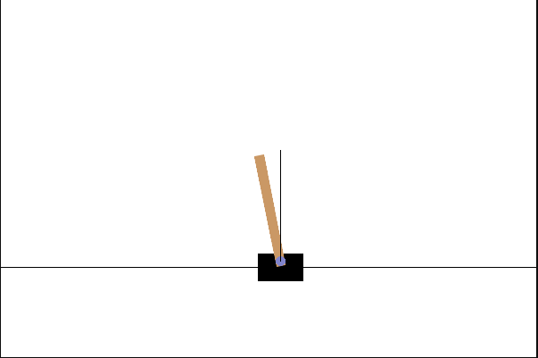

# Обратный маятник



### Неизвестные

* Положение основания
* Угол между стержнем и основанием

---

### Лагранжиан

Напишем лагранжиан с учётом массивного стержня.

Кинетическая энергия тележки:

$$
    T_M = \dfrac{1}{2}M \dot{x}^2
$$

Кинетическая энергия стержня состоит из движения центра масс и вращения стержня

$$
    T_m = \dfrac{1}{2}m v_{cm}^2 + \dfrac{1}{2}I_{cm}\dot{\theta}^2
$$

Центр масс для стержня длиной $l$:

$$
    r_{cm} =
    \begin{pmatrix}
        x - \dfrac{1}{2}l\sin\theta \\ \\
        \dfrac{1}{2}l \cos\theta
    \end{pmatrix}
$$

Скорость центра масс

$$
    v_{cm} = 
    \begin{pmatrix}
        \dot{x} - \dfrac{1}{2}l\dot{\theta}\cos\theta \\\\
        - \dfrac{1}{2}l\dot{\theta}\sin\theta
    \end{pmatrix}
$$

Тогда полная кинетическая энергия стержня:

$$
    T_m = \dfrac{1}{2}m\left( \dot{x}^2 - \dot{x}l\dot{\theta}\cos\theta + \dfrac{1}{4}l^2\dot{\theta}^2 \right) + \dfrac{1}{24}ml^2\dot{\theta}^2
$$

Кинетическая энергия системы

$$
    T = \dfrac{1}{2}M\dot{x}^2 + \dfrac{1}{2}m\left( \dot{x}^2 - \dot{x}l\dot{\theta}\cos\theta + \dfrac{1}{4}l^2\dot{\theta}^2 \right) + \dfrac{1}{24}ml^2\dot{\theta}^2
$$

Потенциальная энергия системы

$$
    U = \dfrac{1}{2}mgl\cos\theta
$$

Лагранжиан системы

$$
    L = T - U
$$

$$
    L = \dfrac{1}{2}M\dot{x}^2 + \dfrac{1}{2}m\left( \dot{x}^2 - \dot{x}l\dot{\theta}\cos\theta + \dfrac{1}{4}l^2\dot{\theta}^2 \right) + \dfrac{1}{24}ml^2\dot{\theta}^2 - \dfrac{1}{2}mgl\cos\theta
$$

Напишем уравнения Эйлера-Лагранжа с учётом того, что в нашей системе присутствует управление $u$, которое может толкать тележку вдоль оси $x$

$$
    \begin{cases}
        \dfrac{d}{dt} \dfrac{\partial L}{\partial \dot{x}} - \dfrac{\partial L}{\partial x}  = u \\\\
        \dfrac{d}{dt} \dfrac{\partial L}{\partial \dot{\theta}} - \dfrac{\partial L}{{\partial \theta}} = 0
    \end{cases}
$$

$$
    \begin{cases}
        u = M\ddot{x} + m\ddot{x} + \dfrac{1}{2}ml\left( - \ddot{\theta}\cos\theta + \sin\theta \dot{\theta}^2 \right) \\\\

        \dfrac{1}{2}ml\dot{x}\dot{\theta}\sin\theta + \dfrac{1}{2}mgl\sin\theta -\dfrac{1}{2}ml \left( \left( - \ddot{x}\cos\theta + \dot{x}\dot{\theta}\sin\theta + \dfrac{1}{2}l\ddot{\theta} \right) + \dfrac{1}{6}l\ddot{\theta} \right) = 0
    \end{cases}
$$

Упростим второе уравнение, сократив на $\dfrac{1}{2}ml$

$$
    -\dot{x}\dot{\theta}\sin\theta + g\sin\theta + \ddot{x}\cos\theta - \dot{x}\dot{\theta}\sin\theta - \dfrac{2}{3}l\ddot{\theta} = 0
$$

Мы решаем задачу о стабилизации маятника, тогда мы всегда будем находиться вблизи равновесия $\left( \theta \approx 0, \ \dot{\theta} \approx 0 \right)$, что позволяет нам линеаризовать уравнения вблизи положения равновесия

$$
    \begin{cases}
        u =  (M + m) \ddot{x} - \dfrac{1}{2}ml\ddot{\theta} \\\\

        g\theta + \ddot{x} - \dfrac{2}{3}l\ddot{\theta} = 0
    \end{cases}
$$

Выразим линейное и угловое ускорения. Для этого из уравнения $(1)$ вычтем $(2)\cdot \dfrac{3}{4}m$.

$$
    \begin{cases}
        u =  (M + \dfrac{1}{4}m) \ddot{x} - \dfrac{3}{4}mg\theta \\\\

        g\theta + \ddot{x} - \dfrac{2}{3}l\ddot{\theta} = 0
    \end{cases}
$$

Теперь из уравнения $(2)$ вычтем $(1)\cdot\dfrac{1}{M + m/4}$

$$
    \begin{cases}
        u =  (M + \dfrac{1}{4}m) \ddot{x} - \dfrac{3}{4}mg\theta \\\\

        g\theta + \dfrac{3}{4}mg\theta\dfrac{1}{M+m/4} - \dfrac{2}{3}l\ddot{\theta} = - \dfrac{u}{M+m/4}
    \end{cases}
$$

$$
    \begin{cases}
        u =  (M + \dfrac{1}{4}m) \ddot{x} - \dfrac{3}{4}mg\theta \\\\

        g\theta\left( 1 + \dfrac{3m}{4M + m} \right)  - \dfrac{2}{3}l\ddot{\theta} = - \dfrac{u}{M+m/4}
    \end{cases}
$$

Теперь выразим $\ddot{x}$ и $\ddot{\theta}$

$$
    \begin{cases}
        \ddot{x} = \dfrac{3mg}{4M+m}\theta + \dfrac{1}{M + m/4}u \\\\
        \ddot{\theta} = \dfrac{3g}{2l}\left( 1 + \dfrac{3m}{4M + m} \right) \theta + \dfrac{3}{2l(M + m/4)} u
    \end{cases}
$$

Сведём к системе уравнений первого порядка при помощи замены $\dot{x} = v$ и $\dot{\theta} = \psi$

$$
    \begin{cases}
        \dot{x} = v \\
        \dot{v} = \dfrac{3mg}{4M+m}\theta + \dfrac{1}{M + m/4}u \\
        \dot{\theta} = \psi \\
        \dot{\psi} = \dfrac{3g}{2l}\left( 1 + \dfrac{3m}{4M + m} \right) \theta + \dfrac{3}{2l(M + m/4)} u
    \end{cases}
$$

Теперь запишем эту систему в матричном виде

$$
    \dot{z} = Az + Bu
$$

$$
    z = 
    \begin{pmatrix}
        x \\ v \\ \theta \\ \psi
    \end{pmatrix}
$$

$$
    A =
    \begin{pmatrix}
        0 & 1 & 0 & 0 \\
        0 & 0 & \dfrac{3mg}{4M+m} & 0 \\
        0 & 0 & 0 & 1 \\
        0 & 0 & \dfrac{3g}{2l}\left( 1 + \dfrac{3m}{4M+m} \right) & 0
    \end{pmatrix}
$$

$$
    B = 
    \begin{pmatrix}
        0 \\ \dfrac{1}{M+m/4} \\ 0 \\ \dfrac{3}{2l(M+m/4)}
    \end{pmatrix}
$$

Для нахождения управления в виде линейно-квадратично регулятора введём критерий оптимальности 

$$
   J = \int\limits_0^\infty\left( z^TQz + u^TRu \right) dt,
$$

где первое слагаемое отвечает за ошибку отклонения системы от положения равновесия, а второе "затраты" исользования искомого управления.

Для минимизации этого критерия будет искать наше упрвление в виде отрицательной обратной связи:

$$
    u = - Kz
$$

Для этого преобразуем критерий оптимальности

$$
    J = z_0^TPz_0 - z_0^TPz_0 + \int\limits_0^\infty\left( z^TQz + u^TRu \right) dt
$$

Здесь $P$ - постоянная симметричная матрица, внесём второе слагаемое под интеграл

$$
    J = z_0^TPz_0 \int\limits_0^\infty\left( \dfrac{d}{dt} \left( z^TPz \right) z^TQz + u^TRu \right) dt
$$

Отметим, что со временем наше состояние стремится к равновесию (нулю), так что $z^T P z \big|_0^{\infty} = 0 - z_0^TPz_0$

Теперь в $J$ раскроем производную по времени

$$
    J = z_0^TPz_0 + \int\limits_0^\infty\left( \dot{z}^TPz + z^TP\dot{z} + z^TQz + u^TRu \right) dt
$$

Подставим $\dot{z} = Az + Bu$

$$
    J = z_0^TPz_0 + \int\limits_0^\infty\left( \left( Az + Bu \right)^TPz + z^TP\left( Az + Bu \right) + z^TQz + u^TRu \right) dt
$$

Сгруппируем слагаемые типа $z^T(\cdot)z$

$$
    J = z_0^TPz_0 + \int\limits_0^\infty\left[ z^T \left( A^TP + PA + Q \right) z + u^TRu + z^TPBu + u^TB^TPz \right] dt
$$

Первое слагаемое не зависит от $u$, поэтому мы не можем его оптимизировать, выделим полный квадрат для оставшихся слагаемых

$$
    u^TRu + z^TPBu + u^TB^TPz = \left( u+R^{-1}B^TPz \right)^TR\left( u+R^{-1}B^TPz \right) - z^T\left( PBR^{-1}B^TP \right)z
$$

Подставим это в $J$

$$
    J = z_0^TPz_0 + \int\limits_0^\infty\left[ z^T \left( A^TP + PA + Q - PBR^{-1}B^TP \right) z + \left( u+R^{-1}B^TPz \right)^TR\left( u+R^{-1}B^TPz \right) \right] dt
$$

Теперь заметим, что мы можем минимизировать $J$, если занулим скобки во втором слагаемом в интеграле. Это можно сделать, если выбрать $u$ следующим образом

$$
    u_* = - R^{-1}B^TPz
$$

То есть $K = R^{-1}B^TP$

Также занулим первое слагаемое в интеграле, для этого нужно 

$$
    A^TP + PA + Q - PBR^{-1}B^TP = 0
$$

Таким образом, мы получили алгебраическое уравнение Риккати.

Решать это уравнение будем численно при помощи ```scipy.linalg.solve_continuous_are```

Методы нахождения матрицы $P$ основаны, например, на использовании разложения Шура для блочной матрицы

$$
    H = 
    \begin{pmatrix}
        A & -BR^{-1}B^T \\
        -Q & -A^T
    \end{pmatrix}
$$

Важно отметить, что в решении угол отсчитывается против часовой стрелки, а в gym'e он отсчитывается по часовой, поэтому в итоговом решении нужно заменить $\theta$ на $-\theta$ и $\psi$ на $-\psi$